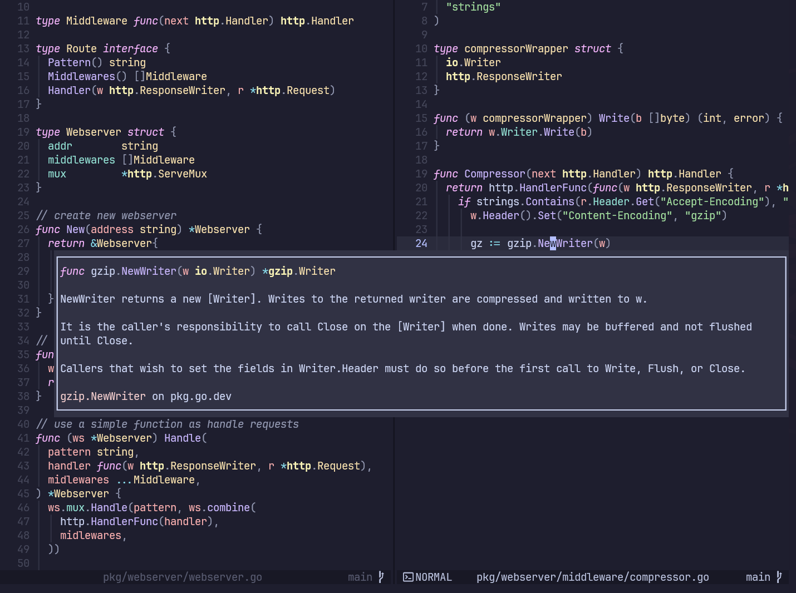
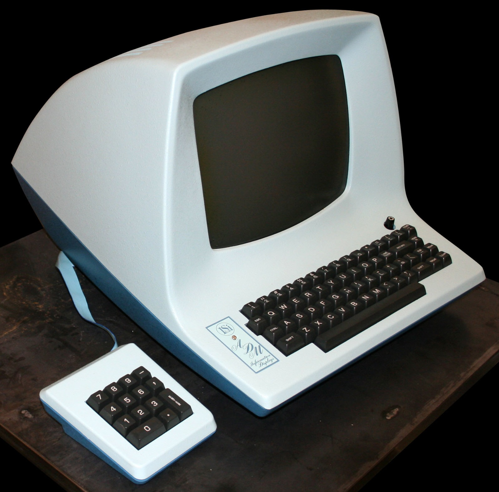
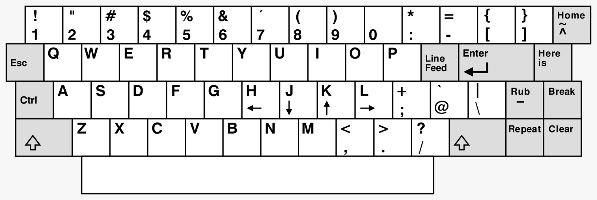
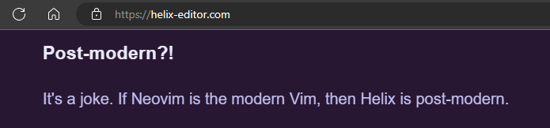

```sh
              .-=--------++:   _     _           _
              +==        .@@: | |   | |   ___   | | (_) __  __
              ++- :: . =  %%= | |___| |  /   \  | |  _  \ \/ /
              =+=  ++*+:  @%* |  ___  | /  ^  | | | | |  \  /
              -=*   :.-  .%%# | |   | | |  ---  | | | |  /  \
              -=#========*%%# |_|   |_|  \___/  |_| |_| /_/\_\
 .......::::.   -=++++++**+:  ......:::---. WASD config v0.1.0
*#-:::::..:#%=.*#-::::...:%%-.*#:::.... :#%-
+*   -:    +%#:+*   -::   *##:++   =-    *%#
**   #%    +%@.**   ::=   *#@.**   + +   *#%
##  ..-    *#@.#*   =-=.  ##@.**   +=.   ##@
*+-.     .:%#@.#+-.......-%#@.#*-......:-%#@
*|||||||||||%% *||||||||||%%  *#********+*%#
 =+*********+.  =+********++.  =++++++++++= 
```

A `metamodern` modal text editor for 21sh century.




# WHAT IS THIS?!

This is my personal [helix editor](https://helix-editor.com/) config, that is my "part-time" editor walking to be the main editor.

I work with node.js, frontend and golang, for this reason my language files are configured for language servers that I use on a daily basis.

## FAQ

<details>
<summary><strong>Why WASD?!</strong></summary>

Have you ever wondered why `vi editor` uses the h, j, k and l keys to navigate through text?

No? Looks this fancy guy bellow:



This is one of the strong reasons, a [ADM-3A](https://en.wikipedia.org/wiki/ADM-3A), a computer terminal introduced in 70's.

And why this is important?

[Vi editor](https://en.wikipedia.org/wiki/Vi_(text_editor)), was created by [Bill Joy](https://en.wikipedia.org/wiki/Bill_Joy) in 1976 in a terminal like this, and bellow is the keybord layout of this family of terminal.



No arrows! The default way to "moving" at this time was h, j, k and l. Now is realy easy to understand why vi use this keybinds.

Almost five decades later, we are still influenced by decisions made in this software. Great job Bill!! 👏👏👏

Editors like [Vim](https://www.vim.org/), [Kakoune](https://kakoune.org/) and more recently [Neovim](https://neovim.io) and [Helix](https://helix-editor.com/) inherited numerous features from vi, this just proves how good and ahead of its time vi was.

The history of computing is incredible, isn't it?! 

But, there had to be a "but", as much as I love modal editors I've never been able to completely adapt to this type of navigation and, and to be honest, if I'm going to move with the keyboard I **really** prefer to use my left hand. Why? Maybe the influence by many, many hours of gaming on the PC? Perhaps ... 

When i put my hands over the keyboard automatically my fingers going to the w, a, s, d. Use the thumb and pinky left to access the modifiers is easy and comfortable to me, leaving my right hand for commands and actions. Yes, like a game... 🤣


**Last but not least*, this is not a recommendation, this is how I like my workflow, is good to me and is all fine if this is not good for you.

</details>

<details>
<summary><strong>Metamodern?!</strong></summary>

> _"**Metamodernism** refers to a number of related discourses about cultural developments that move beyond postmodernism by means of postmodernism. Many metamodern theorists characterize it in terms of both/and mediations between aspects of modernism and postmodernism"._

ref.: [wiki/Metamodernism](https://en.wikipedia.org/wiki/Metamodernism)

This is a joke, about a another joke. If Neovim is modern Vim, then Helix is post-modern, using WASD can only be `metamodernism`.



Sorry, I love art history too. 😼

</details>

<details>
<summary><strong>Why Helix instead of Neovim?</strong></summary>

I could summarize it in personal taste, but Helix has a set of characteristics that I like a lot.

- Light a lot
- Very easy to configure with `.toml` files
- Simplicity
- Multiple cursors
- [Surround](https://docs.helix-editor.com/usage.html#surround)

I also occasionally use neovim, you can check my current setup in [this repository](https://github.com/ortense/nvim), but I was wanting to try something more minimalist.

</details>

<details>
<summary><strong>What theme is this?</strong></summary>

I use a customization of the [Catppuccin Mocha](https://catppuccin.com/palette#flavor-mocha) theme with some colors of my personal taste and [JetBrainsMono Nerd Font](https://www.nerdfonts.com/font-downloads).

I highly recommend any flavor of [Catppuccin as a theme for anything](https://catppuccin.com/ports) you use frequently, your eyes will thank you.

Thank you soooo much [Catppuccin contributors](https://github.com/catppuccin/palette/graphs/contributors)!! 😻

</details>

<details>
<summary><strong>How can I test this crazy thing?</strong></summary>
<br />

**requirements**

  - [Nerd Fonts](https://www.nerdfonts.com/) (Optional but very useful)
  - Install Helix Editor [following the oficial docs](https://docs.helix-editor.com/install.html)
  - [git](https://git-scm.com/) to clone this repo
  - (Optional) [node.js](https://nodejs.org) to install vscode language server 
  - (Optional)[Go](https://go.dev) to install golang language servers


(Optional) If you already has a helix setup make a backup

```sh
cp -r ~/.config/helix ~/.config/helix.bak
```
**setup**

Clone the repository

```sh
git clone https://github.com/ortense/helix ~/.config/helix
```

Remove the git directory

```sh
rm -rf ~/.config/helix/.git
```

Install language servers

```sh
# for html / css
npm i -g vscode-langservers-extracted typescript-language-server @olrtg/emmet-language-server
# go language server
go install github.com/nametake/golangci-lint-langserver@latest
go install github.com/go-delve/delve/cmd/dlv@latest
go install github.com/a-h/templ/cmd/templ@latest
``` 

Install and configure other language servers as needed by following the [official documentation](https://docs.helix-editor.com/languages.html).

</details>


